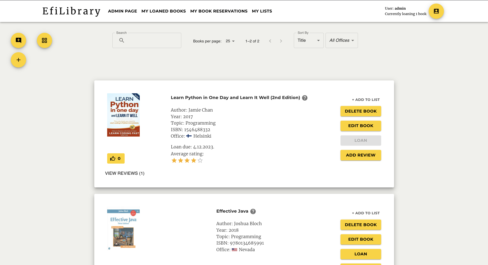

# EfiLibrary - About the project

<!-- ABOUT THE PROJECT -->

<p float="left">
 



</p>

EfiLibrary is a project between the students of Business Information Technology Degree Programme in Haaga-Helia University of Applied Sciences, and Eficode Oy, a Finnish company specializing in enhancing software development, whose products are related to automation and devops consulting, as well as accessibility and user studies.

The EfiLibrary project was created and built from the ground up and in its entirety by the students of Haaga-Helia UAS for the use of Eficode Oy.

This digital library project is the transformation of the many physical copies of books owned by Eficode and scattered in different Eficode offices located in 10 different countries around the world, into one digital library in which the various users will be able to learn-from, teach-with, and enjoy sharing knowledge easily and efficiently.

The users will be able to loan, reserve, and return books, create lists of favorite books and watch other users' favorite lists, as well as browse through the library database.

Admins will be able to control the distribution of borrowed books and monitor the users' activity within the library on a restricted admin page. Admin users can view users, books, loans, reservations, and requests. Admin users can also edit and delete users, and generate a password reset link if need be. In addition, admin users can deny, allow, or cancel book requests and reservations in the restricted admin page.
The EfiLibrary project was created and built from the ground up and in its entirety by the students of Haaga-Helia UAS for the use of Eficode Oy.

Knowledge is power.

This digital library project is the transformation of the many physical copies of books owned by Eficode and scattered in different Eficode offices located in 10 different countries around the world, into one digital library in which the various users will be able to learn-from, teach-with, and enjoy sharing knowledge easily and efficiently.

The users will be able to borrow and return books, create lists of favorite books and watch other users' favorite lists, as well as browse through the library database.

Admins will be able to control the distribution of borrowed books and monitor the users' activity within the library.

## Built with

<!-- ICONS found at: ht<rtps://github.com/devicons/devicon/tree/master/icons -->
<div>
      &nbsp;
      &nbsp;
      &nbsp;
      &nbsp;
      &nbsp;
</div>

<br/>
Efilibrary consists of a frontend and a backend with a connected relational database. Both front- and backend are written in TypeScript and are using React and Express respectively as their main framework and library.
<br/>
<br/>
The frontend’s user interface is divided into pages that are routed through react-router-dom. To access pages other than the login page or signup page, users can create accounts and securely log in in through HTTPS with passwords that are hashed on server-side. Authentication is implemented using Bearer Tokens.
<br/>
<br/>

# Running the Program Locally

> Make sure that the `REACT_APP_BACKEND_URL` in the frontend `.env ` matches the port in the backend `.env`. Or if you're using docker-compose, the port in the docker-compose file.

## Using docker-compose

To run the frontend with docker-compose, you need to create a docker.env file in the root of the frontend project. In this file you need to add the exact same content as in the existing .env file. So copy and paste that in the docker.env file.

> Make sure the backend is running before next steps.
> You can check if the backend is running here: http://localhost:3002/health
> It should say: "ok: true"

Now run the command (windows users make sure you have docker desktop running):

```
docker-compose -f docker-compose-start.yml up -d
```

Now with both backend and frontend running, open the app at http://localhost:3000/

<!-- INSTALLATION -->

## How to Install

You need to have npm installed to run this project, you can check if you have it installed by running `npm -v` in the command line.

Clone the repository on your computer. Detailed instructions can be found [here](https://docs.github.com/en/repositories/creating-and-managing-repositories/cloning-a-repository?tool=webui).

Use `npm ci` or `npm install` to install node modules.

<!-- RUNNING -->

## How to Run

```pwsh
npm start
```

This runs the app in the development mode.
Open [http://localhost:3000](http://localhost:3000) to view it in the browser.\
The page will reload if you make edits.

You will also need the [backend](https://github.com/LibraryProjectGroup/library-project-backend) running for the application to work.

<!-- ROBOT TESTS -->

# RobotTests

See detailed documentation about Robot testing in [AboutRobotTests.md documentation file](robot/aboutRobotTests.md).

<!-- WORKFLOWS -->

# Workflows

## The Prettier workflow

The Prettier workflow is setup in the code with Pretty-quick (https://github.com/azz/pretty-quick) and Husky (https://typicode.github.io/husky/) to ensure consistent foramtting. Pretty-Quick checks formatting when a developer tries to commit to the repo, and fixes formatting using our prettier config (.prettierrc.json file in the root of the project). Husky ensures that the pre-commit checks works with a pre-commit hook. Make sure you have all dependencies installed by running: `npm install` before you start. In your code editor, you can also set prettier checks on save, which will help the process.

<!-- DEPLOYMENT -->

# Deployment

# Future developments

You can see our previous [backlog](https://github.com/orgs/LibraryProjectGroup/projects/3/views/8) for tasks that we were planning on doing, but didn't have the time to do.

If you want to be made the owner of this organization (or if you feel like asking questions) you can contact Julia Söderlund trough school email.

<!-- CREDITS -->

# Credits

Attribution in alphabetical order:

- Sebastian Bergman
- Jordie Biemold
- Michael Brown
- Raúl Fernández Poolan
- Markku Känkänen
- Eeli Killström
- Amaru Korpimäki
- Jong Lau
- Jasmin Lumme
- Anja Miscevic
- Dung Pham
- Shay Pisanty
- Axel Riska
- Aleksi Saarinen
- Markus Sibakov
- Julia Söderlund
- Elisa Tuovila
- Veeti Vainikka
- Riku Vartiainen
- Tia Venäläinen
- Dmitry Sinyavskiy
- Ivan Kolesov
- Palmitos254

<!-- LICENSE -->

# License

See the project's MIT License in [LICENSE.md](LICENSE.md)
